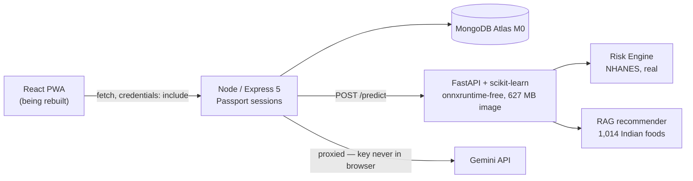

# Niyantrana

Metabolic risk screening for an Indian user base — fatty liver, dysglycaemia and hypertension — estimated from what a person eats, how they move and how they sleep.

> **Status:** backend and ML complete and tested (163 tests). Frontend being rebuilt. Not yet deployed — see [docs/MANUAL_CHECKLIST.md](docs/MANUAL_CHECKLIST.md).
>
> **Not a medical device.** Screening and education only. Every risk score carries this disclaimer in the API response.

---

## The problem

About 1 in 3 Indians has fatty liver, ~16% of adults have type-2 diabetes, ~25% have hypertension — and these cluster: over 70% of diabetics also have fatty liver. Blood tests catch them late and episodically.

Diet, steps, sleep and heart rate, by contrast, are continuous. So: **estimate metabolic risk from behaviour, and show how it moves.**

## What it actually does

```
profile + meal logs + wearable history
        ↓
Risk Engine  (gradient boosting, trained on 17,961 real NHANES adults)
        ↓
4 calibrated risks + estimated biomarkers + a trajectory over time
        ↓
RAG meal recommendations from 1,014 Indian foods (Anuvaad INDB)
```

| Output | Source |
|---|---|
| Condition probability | Calibrated classifier |
| Biomarker levels (HbA1c, BP, TG, GGT, FLI) | Regression engine |
| Why the score is what it is | Clinical scorers + SHAP |
| Risk over time | The same model over rolling 14-day windows |
| Anything you measured | **Overrides every estimate** |

---

## Honest results

Trained on NHANES 2013–2018. Reported on a **cycle holdout** — train 2013–16, test 2017–18 — because "does this survive a survey wave collected years later" is the question that matters.

### Classification

| Condition | Prevalence | AUROC | Sensitivity | Specificity | PPV |
|---|---|---|---|---|---|
| Hypertension | 49.8% | **0.802** | 91% | 0.53 | 0.66 |
| Dysglycaemia | 41.2% | **0.799** | 93% | 0.43 | 0.54 |
| Diabetes | 16.9% | **0.799** | 90% | 0.55 | 0.29 |
| Fatty liver | 42.7% | 0.958 | 92% | 0.83 | 0.80 |

Operating points target **90% sensitivity**, not accuracy. This is screening: missing an at-risk person costs more than a false alarm that resolves with a blood test. The consequence is low PPV — at the diabetes threshold, roughly 7 of 10 flagged people don't have it. The product wording says *get tested*, never *you have this*.

### Two numbers that need an asterisk

**Fatty liver's 0.958 is close to a tautology.** FLI is a formula whose four terms include BMI and waist — which we *measure*, not estimate. A classifier on `bmi + waist_cm` alone scores **0.9548**; the other 14 features add **+0.003**. A test keeps that baseline recorded so the headline can never be quoted bare.

**GGT is unpredictable from lifestyle** (R² −0.001). It's driven by alcohol, medication and genetics. Reported as a negative result.

Full write-up, including the ablation and every limitation: **[ml/RESULTS.md](ml/RESULTS.md)**

---

## The finding this project is really about

The previous version reported **R² 0.900 (triglycerides) / 0.974 (GGT)** from an LSTM on synthetic data. Both figures were artifacts:

| | |
|---|---|
| Leak 1 | `MinMaxScaler.fit_transform` ran on all 5,475 rows **before** the train/test split |
| Leak 2 | The split was random over 14-day sliding windows overlapping by **13 of 14 days**, same 15 users on both sides |
| Corrected | Split by **disjoint user**, scalers fit on train only → **R² −0.89 / −0.87** — worse than predicting the mean |

Separately, the *served* model was broken: `predict.py` concatenated a 1-row profile with a 14-row window on `axis=1`, leaving the tabular branch all-NaN. Every user got a bit-identical prediction. Verified — a healthy 20-year-old and a high-risk 73-year-old both returned `153.47 / 34.44`.

Fifteen synthetic personas is **nine training examples at the person level**. Hence the move to real data.

### And the one that mattered most

While building the trajectory feature, a mid-range profile showed **hypertension risk rising (+0.79/week) as activity and sleep improved.** Gradient boosting fits non-monotonic relationships freely, and it did. Every aggregate metric looked fine — AUROC 0.80, calibration within 0.05. Only walking a trajectory exposed it.

Fixed with monotonic constraints on activity and sedentary time, at a cost of **≤0.005 AUROC**. Sleep is deliberately left unconstrained: it's U-shaped clinically. A test now asserts that improving behaviour never raises any risk, across four profiles.

---

## The rule the architecture enforces

**No layer ever invents a number.**

Every risk value carries a `provenance` (`model` / `simulation` / `heuristic` / `unavailable`) and a `basis` (`calibrated_classifier` / `clinical_formula`). Provenance is a **required** field on `RiskScore`, on the API response, and on the Mongoose schema — so a score cannot be returned or persisted without declaring where it came from.

This replaced three places where v1 returned `Math.random()` with HTTP 200:

| v1 | v2 |
|---|---|
| ML unreachable → `TG: 150 + Math.random()*50` | **503**, `provenance: "unavailable"`, no scores |
| Empty wearable history → 14 fabricated days | `400` naming how many days exist |
| Missing FLI inputs → the literal `50` | Returns `null`; the scorer abstains |
| "Doctor's Report" → a stranger's fabricated 2023 labs | Deleted |

Locked by tests in both services.

---

## Architecture



Layered, dependencies pointing inward:

```
ml/src/        domain → features → inference → risk → api   (+ training, data, recommendation)
backend2/src/  config → domain → models → repositories → services → controllers → routes
```

`domain/` holds no I/O and no framework imports in either service. Full design rationale, and every decision mapped to a named refactoring: **[docs/ARCHITECTURE.md](docs/ARCHITECTURE.md)** · **[docs/REFACTORING.md](docs/REFACTORING.md)**

### Why the inference image excludes TensorFlow

Measured: importing TensorFlow costs **358 MB RSS**; onnxruntime costs 33 MB; the shipped models are scikit-learn estimators needing neither. The container runs at **145 MiB of a 512 MiB cap** with `/predict` at **54–66 ms**. That is what makes a free tier viable.

---

## Stack

| | |
|---|---|
| ML | Python 3.13, scikit-learn `HistGradientBoosting`, SHAP |
| Data | NHANES 2013–2018 (CDC, public domain), Anuvaad INDB 2024.11 |
| API | Node 22, Express 5, Mongoose, Passport (session cookies) |
| Inference | FastAPI, Pydantic, uvicorn |
| Tests | pytest (84) + `node:test` (79) — **163 total, zero test-framework dependencies on the Node side** |
| Deploy | Render × 2 + MongoDB Atlas M0, `render.yaml` blueprint |

---

## Run it locally

Both dependencies are containers. On Windows with a user-level Docker install, see [ml/DOCKER.md](ml/DOCKER.md) for the PATH export.

```bash
# 1. Database + inference service
docker run -d --name niy-mongo -p 27017:27017 mongo:7
cd ml && docker build -t niyantrana-inference:v2 . \
  && docker run -d --name niy-ml --memory=512m --cpus=0.5 -p 8000:8000 niyantrana-inference:v2

# 2. API
cd ../backend2 && npm install && npm run seed     # loads 1,014 Indian foods
MONGO_URI=mongodb://127.0.0.1:27017/niyantrana \
SESSION_SECRET=a-long-enough-dev-secret \
ML_SERVICE_URL=http://127.0.0.1:8000 npm start

# 3. Try it
curl -s -c j -X POST localhost:8080/auth/register -H 'Content-Type: application/json' \
  -d '{"email":"you@example.com","password":"a-long-enough-password"}'
curl -s -c j -X POST localhost:8080/auth/login -H 'Content-Type: application/json' \
  -d '{"email":"you@example.com","password":"a-long-enough-password"}'
curl -s -b j -X POST localhost:8080/api/wearable/demo -H 'Content-Type: application/json' -d '{"days":90}'
curl -s -b j -X POST localhost:8080/api/predict -H 'Content-Type: application/json' -d '{}'
```

`--memory=512m --cpus=0.5` mirrors the free tier, so an OOM shows up locally rather than in production.

### Reproduce the models from scratch

```bash
cd ml
python -m src.data.nhanes.download        # ~25 MB from the CDC, no registration needed
python -m src.data.nhanes.build_dataset   # → 17,961 adults
python -m src.training.train_risk_engine  # regression heads + metrics
python -m src.training.train_classifiers  # calibrated classifiers + SHAP
python -m pytest tests/ -q
```

### Tests

```bash
cd ml       && python -m pytest tests/ -q     # 84
cd backend2 && npm test                       # 79 (needs Mongo + inference running)
```

---

## Wearable data

Every consumer wearable API a solo developer could register for has closed. Verified September 2026:

| Provider | Status |
|---|---|
| Google Fit | New signups closed 1 May 2024; APIs deprecating |
| Fitbit Web API | New signups closed 1 May 2024; **sunset September 2026** |
| Google Health API | Replacement for both; every scope Restricted → privacy/security review |
| Garmin | Requires a legal entity; rejects personal-use applications |
| Withings, Oura | ✅ still open to individual developers |

So **file import is the primary path**, not a fallback. `POST /api/wearable/import` accepts CSV, a JSON array, or the per-metric shape Google Takeout produces, normalising ~40 field aliases across Fitbit / Apple Health / Oura / Withings. It needs no device, and cannot be deprecated out from under the project.

`POST /api/wearable/demo` seeds 90 days of correlated, deterministic history — every row stored with `source: "demo"`, so seeded data is distinguishable at the record level rather than by a banner.

---

## Limitations

1. **NHANES is a US population.** South Asians develop metabolic disease at lower BMI and waist thresholds; an India-deployed model needs recalibration against NFHS-5 / LASI.
2. **Cross-sectional.** One blood draw per person, so the model estimates a current level rather than observing response to change.
3. **Fatty liver is largely an anthropometric restatement** (see above).
4. **GGT is not predictable** here, which caps how far the fatty-liver estimate can improve.
5. **High predicted probabilities are overconfident** — dysglycaemia predicts 0.88 where 0.64 are observed (thin bins).
6. **Diet is one 24-hour recall** in NHANES: noisy, self-reported, not habitual intake.
7. **Sleep and activity are self-reported in NHANES but sensor-measured in the app.** The instrument mismatch is unquantified.
8. **The trajectory is a trajectory of estimates**, produced by a model fitted across people rather than within one.

## What I'd do next

- Recalibrate on **LASI** (~72,000 Indians with HbA1c and BP) for India-appropriate thresholds
- Add **Withings or Oura** OAuth behind the existing provider seam
- Quantify the self-report vs sensor gap using NHANES `PAXDAY` accelerometry, which is paired within-person with the questionnaire
- Rebuild the frontend against the real API

---

## Repository

| Path | |
|---|---|
| [ml/](ml/) | Training, inference, FastAPI service, 84 tests |
| [backend2/](backend2/) | Node API, 79 integration tests |
| [frontend/](frontend/) | React PWA — **being rebuilt** |
| [docs/](docs/) | Architecture, refactoring log, data sources, deployment, manual checklist |
| [ml/RESULTS.md](ml/RESULTS.md) | Every metric, ablation and negative result |
| [PROJECT_PLAN.md](PROJECT_PLAN.md) | Day-by-day build log |

Originally built for **NEXOVATE'25** (*CodeCure — Healthcare & Wellbeing Tech*) by Team Basement — Swami Agnivesh, Vamshidhar Reddy, Sushanth Kartikeya, Shri Krushna Vardhan (VNR VJIET, Hyderabad). Rebuilt since as a portfolio project.

## Licence

MIT. NHANES is US public domain. Anuvaad INDB 2024.11 is credited to its authors.
