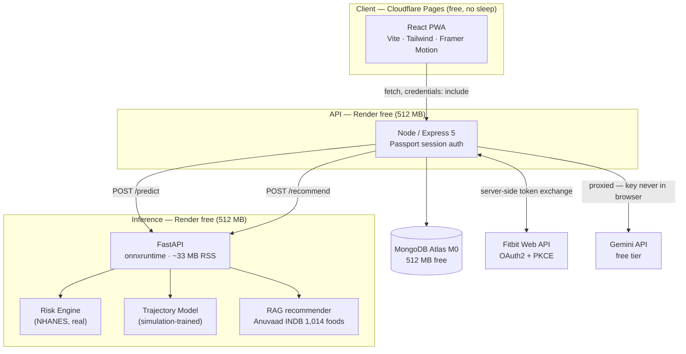
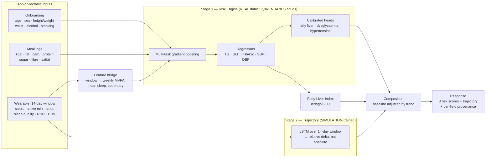

# Niyantrana — Architecture v2

> **Status:** target design. Day 1 of 15 complete (ML foundations + real-data ingest).
> Supersedes the v1 design described in the pitch decks.

---

## 1. Why v1 had to be redesigned

The v1 design asked a single model to predict **today's blood biomarkers** from **14 days of wearable data**.

That target cannot be supervised by any real dataset, because nobody draws blood daily. This is *why* the project had to generate synthetic data — and why the synthetic data could not work:

| | v1 result |
|---|---|
| Reported | R² 0.900 (TG) / 0.974 (GGT) |
| Cause | Scalers fit before splitting; random split over 14-day windows overlapping 13/14 days, same 15 users on both sides |
| Actual, on disjoint users | **R² −0.89 / −0.87 — worse than predicting the mean** |
| Served path | MLP branch fed all-NaN; every user got a bit-identical prediction |

At the person level, 15 synthetic personas is **9 training examples**. No architecture recovers from that.

**The v2 insight — the feature bridge:**

NHANES measures self-reported **sleep duration** (`SLD012`) and **weekly activity minutes** (`PAQ`). A wearable measures the same two quantities with a different instrument. So instead of forcing raw wearable sequences into a model no real data can train, v2 **derives NHANES-comparable features from the wearable window** and trains the core model on 17,961 real adults.

The wearable stops being the thing the model can't learn from, and becomes the thing that keeps those features fresh.

---

## 2. System topology



**Three deployed services, not four.** The standalone `rag_engine/` is folded into the inference service — free-tier instance-hours are shared per workspace, and the RAG layer already needs the same food database.

**Why onnxruntime and not TensorFlow:** measured on this machine, importing TensorFlow costs **358 MB RSS**; onnxruntime costs **33 MB**. Render's free tier caps at 512 MB. Training stays in Keras offline; only the exported ONNX graph ships. Parity verified at 5.9e-08.

---

## 3. ML architecture



### Stage 1 — Risk Engine (the scientific core)

Trained on **real NHANES data**, using only features the app can supply.

| Group | Features |
|---|---|
| Profile | `age`, `sex_male`, `bmi`, `waist_cm` |
| Diet (24h) | `energy_kcal`, `fat_g`, `carb_g`, `protein_g`, `sugar_g`, `fibre_g`, `satfat_g` |
| Wearable-derived | `sleep_hours`, `mvpa_min_week`, `vigorous_min_week`, `moderate_min_week`, `sedentary_min_day` |
| Lifestyle | `alcohol_drinks_week`, `smoking_status` |

Alcohol is new in v2 and matters: it is a **major GGT confounder** that v1 ignored entirely while using GGT as a headline output.

**Model:** `HistGradientBoostingRegressor` (scikit-learn). Chosen over XGBoost/LightGBM because it handles NaN natively — essential for NHANES, where every column has real missingness — and adds **zero deployment dependencies** beyond the scikit-learn already needed for scalers.

**Targets and availability** (from the ingested 17,961 adults):

| Target | n | Feeds |
|---|---|---|
| `ggt` | 16,155 | FLI |
| `hba1c` | 16,392 | Diabetes head |
| `systolic_bp` / `diastolic_bp` | 16,536 / 16,416 | Hypertension head |
| `triglycerides` | 7,543 | FLI (fasting subsample) |
| `fli` (derived) | 7,155 | Fatty liver head |

**Derived risk heads:**
- Fatty liver — FLI ≥ 60 (Bedogni)
- Dysglycaemia — HbA1c ≥ 5.7 (pre) / ≥ 6.5 (diabetic)
- Hypertension — ≥ 130/80

This is what finally delivers the deck's *"jointly predicts all three conditions"* claim. v1 only ever produced fatty liver.

### Stage 2 — Trajectory model

The LSTM survives, with its job changed. It no longer predicts absolute biomarker values (unsupervisable). It predicts a **relative trend** on top of the Stage 1 baseline, and every response it touches is tagged `simulation-trained` until real longitudinal data is secured.

### Stage 3 — Risk trajectory

Run the Risk Engine over rolling windows of the user's history → a risk time series → fit a trend → extrapolate. This delivers the deck's "early warning / risk trajectory" promise using only defensible inputs, with no pretence of daily blood draws.

---

## 4. The provenance contract

The single most important rule in this codebase, because v1 violated it in three places:

> **Never emit a number without saying where it came from.**

Every risk value in every API response carries a `source`:

| `source` | Meaning |
|---|---|
| `model` | Real prediction from the NHANES-trained Risk Engine |
| `simulation` | Involves the simulation-trained trajectory model |
| `heuristic` | Rule-based fallback (e.g. FLI computed from user-entered labs) |
| `unavailable` | Inference failed — **an error, never a substituted value** |

What v1 did instead, and v2 deletes:
- `apiRoutes.js` returned `TG: 150 + Math.random()*50` on any ML failure, always with HTTP 200
- `apiService.jsx` returned `riskScore: Math.random()*100` as an "AI risk assessment"
- `profileService.js` returned a **stranger's fabricated 2023 lab values** as the user's Doctor's Report

The UI surfaces the badge, alongside a standing medical disclaimer: advisory only, not a diagnostic device, confirm with clinical tests.

---

## 5. Request flow

```
POST /api/predict   (session cookie)
  │
  ├─ Load user profile + last 14 days of watchHistory from Mongo
  ├─ Aggregate meal logs → daily macro totals
  ├─ Feature bridge: window → weekly MVPA, mean sleep, sedentary
  │
  ├─ POST → inference service /predict
  │     ├─ Risk Engine  → TG, GGT, HbA1c, SBP, DBP → FLI → 3 calibrated risks
  │     └─ Trajectory   → trend delta  [tagged: simulation]
  │
  ├─ On failure → 503 with source:"unavailable"   ← never a fabricated number
  │
  └─ 200 { risks: {...}, trajectory: [...], source: "model", disclaimer: "..." }
```

---

## 6. Security posture

| Concern | v1 | v2 |
|---|---|---|
| Gemini API key | Shipped in the browser bundle (`VITE_GEMINI_API_KEY`) | Server-side only, proxied via `/api/chat` |
| Fitbit secret | n/a | Server-side token exchange, PKCE; never in the client |
| Key logging | `console.log("My Gemini Key Is:", ...)` on every boot | Removed |
| Flask debug | `debug=True` on `0.0.0.0` — remote Werkzeug console | Removed; FastAPI, no debug |
| Session secret | Hardcoded fallback `'a secret key for the hackathon'` | Required env var, boot fails without it |
| Cookies | `secure: false` | `secure: true`, `sameSite: none`, `trust proxy` |
| Health data | PHI unencrypted in browser localStorage | Server-side, per-user isolated |

---

## 7. Deployment

| Layer | Platform | Free-tier reality (Sept 2026) |
|---|---|---|
| Frontend | Cloudflare Pages | Free, global CDN, **no sleep** |
| Node API | Render free web service | 512 MB / 0.1 CPU, sleeps after 15 min, ~1 min cold start |
| Inference | Render free web service | Same; fits only because TF was dropped |
| Database | MongoDB Atlas M0 | 512 MB, free forever, no card |
| LLM | Gemini API free tier | ~10 RPM on 2.5 Flash |

Total cost: **₹0/month.** Cold start is the one real cost — wake the URL before demoing.

Upgrade path: GitHub Student Developer Pack (DigitalOcean $200, Azure $100) buys always-on if the cold start becomes annoying.

---

## 8. Known limitations (state these openly)

1. **NHANES is a US population.** Metabolic thresholds differ for South Asians — Indian cohorts show higher risk at lower BMI. Day 4 calibrates against NFHS-5/LASI; until then, the model is US-calibrated and says so.
2. **Triglycerides come from the fasting subsample** (7,543 of 17,961), so the FLI head trains on less data than the GGT/HbA1c/BP heads.
3. **The trajectory model is simulation-trained.** No open dataset pairs longitudinal wearable data with repeated biomarker draws at usable scale.
4. **NHANES diet is a single 24-hour recall**, which is noisy — it captures one day, not habitual intake.
5. **This is not a medical device.** Screening and education only.
